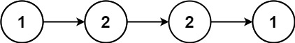

## LeetCode 热题Top100

### 238. 除自身以外数组的乘积
给你一个整数数组 nums，返回 数组 answer ，其中 answer[i] 等于 nums 中除 nums[i] 之外其余各元素的乘积 。
题目数据 保证 数组 nums之中任意元素的全部前缀元素和后缀的乘积都在  32 位 整数范围内。
请 不要使用除法，且在 O(n) 时间复杂度内完成此题。

示例 1:
>输入: nums = [1,2,3,4]
>输出: [24,12,8,6]

示例 2:
>输入: nums = [-1,1,0,-3,3]
>输出: [0,0,9,0,0]

```java
public class Solution {
    public int[] productExceptSelf(int[] nums) {
        int[] res = new int[nums.length];
        res[0] = 1;
        // 先计算i左侧所有数的乘积
        for (int i = 1; i < nums.length; i++) {
            res[i] = res[i - 1] * nums[i - 1];
        }
        // 存储右边元素的乘积
        int tmp = 1;
        // 计算右上角
        for (int i = nums.length - 2; i >= 0; i--) {
            // 计算右边元素的乘积
            tmp *= nums[i + 1];
            // 左右相乘
            res[i] *= tmp;
        }
        return res;
    }
}

```

### 41. 缺失的第一个正数
给你一个未排序的整数数组 nums ，请你找出其中没有出现的最小的正整数。
请你实现时间复杂度为 O(n) 并且只使用常数级别额外空间的解决方案。


示例 1：
输入：nums = [1,2,0]
输出：3

 
示例 2：
输入：nums = [3,4,-1,1]
输出：2

示例 3：
输入：nums = [7,8,9,11,12]
输出：1
```java

public class Solution {
    /**
     * 哈希表解法， 先放入hash表中，然后从1开始找。
     */
    public int firstMissingPositive(int[] nums) {
        Set<Integer> set = new HashSet<>();
        for (int num : nums) {
            set.add(num);
        }
        int i = 1;
        while (true) {
            if (!set.contains(i)) {
                return i;
            }
            i++;
        }
    }
    /**
     * 数组长度为N， 结果一定是[1,N+1]之间
     * 我们把[1,N+1]之外的数设置为N+1
     * 然后把[1, N]下标对应的数据改为负数
     * 那么第一个正数的下标+1就是结果， 因为[1, N]对应的下标都设置成-1负数了，  没有设置的就是不存在的结果。
     */
    public int firstMissingPositiveV2(int[] nums) {

        int n = nums.length;
        for (int i = 0; i < n; i++) {
            if (nums[i] > n || nums[i] < 1) {
                nums[i] = n + 1;
            }
        }
        for (int i = 0; i < n; i++) {
            // 取绝对值，因为有可能被改成了负数
            int num = Math.abs(nums[i]);
            if (num <= n) {
                // 用绝对值，避免两次修改同一个位置数据，如[1,1]
                nums[num - 1] = -Math.abs(nums[num - 1]);
            }
        }
        for (int i = 0; i < n; i++) {
            if (nums[i] > 0) {
                return i+1;
            }
        }
        // 如果没有找到则直接返回n+1
        return n + 1;
    }
}
```

### 73. 矩阵置零
给定一个 m x n 的矩阵，如果一个元素为 0 ，则将其所在行和列的所有元素都设为 0 。请使用 原地 算法。

示例 1：

输入：matrix = [[1,1,1],[1,0,1],[1,1,1]]
输出：[[1,0,1],[0,0,0],[1,0,1]]

示例 2：

输入：matrix = [[0,1,2,0],[3,4,5,2],[1,3,1,5]]
输出：[[0,0,0,0],[0,4,5,0],[0,3,1,0]]
```java
public class SetMatrixZeroes {

    /**
     * 额外的空间标记
     *
     * @param matrix
     */
    public void setZeroes(int[][] matrix) {
        boolean[] row = new boolean[matrix.length];
        boolean[] col = new boolean[matrix[0].length];

        for (int i = 0; i < matrix.length; i++) {
            for (int j = 0; j < matrix[0].length; j++) {
                // 标记对应的row和col
                if (matrix[i][j] == 0) {
                    row[i] = true;
                    col[j] = true;
                }
            }
        }

        for (int i = 0; i < matrix.length; i++) {
            for (int j = 0; j < matrix[0].length; j++) {
                // row或者col被标记，该元素都为0。
                if (row[i] || col[j]) {
                    matrix[i][j] = 0;
                }
            }
        }
    }

    /**
     * 使用第一行和第一列进行标记
     * [[1,1,1],
     * [1,0,1],
     * [1,1,1]]
     * <p>
     * 用matrix[1,0] 和matrix[0,1]标记，
     * 记录第一行和第一列是否有0
     * @param matrix
     */
    public void setZeroesV2(int[][] matrix) {
        boolean rowFlag = false, colFlag = false;
        // 标记col是否有0
        for (int i = 0; i < matrix.length; i++) {
            if (matrix[i][0] == 0) {
                colFlag = true;
            }
        }
        // 标记row是否有0
        for (int i = 0; i < matrix[0].length; i++) {
            if (matrix[0][i] == 0) {
                rowFlag = true;
            }
        }
        // 如果中间元素有0，标记第一行和第一列
        for (int i = 1; i < matrix.length; i++) {
            for (int j = 1; j < matrix[0].length; j++) {
                if (matrix[i][j] == 0) {
                    matrix[i][0] = 0;
                    matrix[0][j] = 0;
                }
            }
        }
        // 根据第一行和第一列的标记，设置当前元素
        for (int i = 1; i < matrix.length; i++) {
            for (int j = 1; j < matrix[0].length; j++) {
                if (matrix[i][0] == 0 || matrix[0][j] == 0) {
                    matrix[i][j] = 0;
                }
            }
        }
        // 如果列标记为true，则设置第一列所有元素为0
        if (colFlag) {
            for (int i = 0; i < matrix.length; i++) {
                matrix[i][0] = 0;
            }
        }
        // 如果行标记为true，则设置第一行所有元素为0
        if (rowFlag) {
            for (int i = 0; i < matrix[0].length; i++) {
                matrix[0][i] = 0;
            }
        }


    }

    /**
     * 使用第一行和第一列进行标记
     * [[1,1,1],
     * [1,0,1],
     * [1,1,1]]
     * <p>
     * 用matrix[1,0] 和matrix[0,1]标记，
     * 只记录第一列是否有0
     * @param matrix
     */
    public void setZeroesV3(int[][] matrix) {
        boolean colFlag = false;
        // 标记col是否有0
        for (int i = 0; i < matrix.length; i++) {
            if (matrix[i][0] == 0) {
                colFlag = true;
            }

            for (int j = 1; j < matrix[0].length; j++) {
                // 如果中间元素有0，标记第一行和第一列
                if (matrix[i][j] == 0) {
                    matrix[i][0] = 0;
                    matrix[0][j] = 0;
                }
            }
        }
        // 第一行要最后更新
        for (int i = matrix.length - 1; i >= 0; i--) {
            for (int j = 1; j < matrix[0].length; j++) {
                if (matrix[i][0] == 0 || matrix[0][j] == 0) {
                    matrix[i][j] = 0;
                }
            }
            // 如果列标记为true，则设置第一列所有元素为0
            if (colFlag) {
                matrix[i][0] = 0;
            }
        }
    }
}
```

### 54. 螺旋矩阵
给你一个 m 行 n 列的矩阵 matrix ，请按照 顺时针螺旋顺序 ，返回矩阵中的所有元素。
示例 1：

输入：matrix = [[1,2,3],[4,5,6],[7,8,9]]
输出：[1,2,3,6,9,8,7,4,5]
示例 2：

输入：matrix = [[1,2,3,4],[5,6,7,8],[9,10,11,12]]
输出：[1,2,3,4,8,12,˚11,10,9,5,6,7]
```java
public class SpiralMatrix {

    public List<Integer> spiralOrder(int[][] matrix) {
        List<Integer> res = new ArrayList<>();

        int l = 0, r = matrix[0].length - 1, t = 0, b = matrix.length - 1;
        while (true) {
            // 向右移动
            for (int i = l; i <= r; i++) res.add(matrix[t][i]);
            if (++t > b) break; // 向下移动一格，判断是否跳出循环
            // 向下移动
            for (int i = t; i <= b; i++) res.add(matrix[i][r]);
            if (--r < l) break; // 向左移动一格，判断是否跳出循环
            // 向左移动
            for (int i = r; i >= l; i--) res.add(matrix[b][i]);
            if (--b < t) break; // 向上移动一格，判断是否跳出循环
            // 向上移动
            for (int i = b; i >= t; i--) res.add(matrix[i][l]);
            if (++l > r) break; // 向右移动一格，判断是否跳出循环
        }
        return res;
    }
}

```

### 48. 旋转图像
给定一个 n × n 的二维矩阵 matrix 表示一个图像。请你将图像顺时针旋转 90 度。
你必须在 原地 旋转图像，这意味着你需要直接修改输入的二维矩阵。请不要 使用另一个矩阵来旋转图像。

示例 1：
>输入：matrix = [[1,2,3],[4,5,6],[7,8,9]]
输出：[[7,4,1],[8,5,2],[9,6,3]]

示例 2：
>输入：matrix = [[5,1,9,11],[2,4,8,10],[13,3,6,7],[15,14,12,16]]
输出：[[15,13,2,5],[14,3,4,1],[12,6,8,9],[16,7,10,11]]
```java
public class RotateImage {

    /**
     * 顺时针旋转， 相当于沿左上-右下对角线对折，然后反转每一行的位置。
     * @param matrix
     */
    public void rotate(int[][] matrix) {
        int n = matrix.length;
        for (int i = 0; i < n; i++) {
            for (int j = 0; j < i; j++) {
                // 沿着对角线对折
                int tmp = matrix[i][j];
                matrix[i][j] = matrix[j][i];
                matrix[j][i] = tmp;
            }
        }

        for (int i = 0; i < n; i++) {
            reverse(matrix[i]);
        }
    }

    /**
     * 反转数组
     * @param nums
     */
    private void reverse(int[] nums) {
        int start = 0, end = nums.length - 1;
        while (start < end) {
            int tmp = nums[start];
            nums[start] = nums[end];
            nums[end] = tmp;
            start++;
            end--;
        }
    }
}
```


### 240. 搜索二维矩阵 II
编写一个高效的算法来搜索 m x n 矩阵 matrix 中的一个目标值 target 。该矩阵具有以下特性：

每行的元素从左到右升序排列。
每列的元素从上到下升序排列。

示例 1：

输入：matrix = [[1,4,7,11,15],[2,5,8,12,19],[3,6,9,16,22],[10,13,14,17,24],[18,21,23,26,30]], target = 5
输出：true

示例 2：

输入：matrix = [[1,4,7,11,15],[2,5,8,12,19],[3,6,9,16,22],[10,13,14,17,24],[18,21,23,26,30]], target = 20
输出：false
```java
public class SearchA2DMatrix2 {
    public boolean searchMatrix(int[][] matrix, int target) {
        int i = 0, j = matrix[0].length - 1;
        // 从右上角开始查找
        while (i < matrix.length && j >= 0) {
            // 找到了直接返回
            if (matrix[i][j] == target) {
                return true;
            }
            // 如果大于target， 则往左找
            if (matrix[i][j] > target) {
                j--;
            } else { // 如果小于target， 则往下找
                i++;
            }
        }
        return false;
    }
}

```

### 160. 相交链表
给你两个单链表的头节点 headA 和 headB ，请你找出并返回两个单链表相交的起始节点。如果两个链表不存在相交节点，返回 null 。
图示两个链表在节点 c1 开始相交：

题目数据 保证 整个链式结构中不存在环。

注意，函数返回结果后，链表必须 保持其原始结构 。

```java
public class IntersectionOfTwoLinkedLists {

    /**
     *  走到列尾后接着遍历第二个队列， 有相交的话就会同时走到相同的节点，如果没有相交的话第二次会同时到达列尾。
     */
    public ListNode getIntersectionNode(ListNode headA, ListNode headB) {
        ListNode pA = headA, pB = headB;
        while (pA != pB) {
            pA = pA == null ? headB : pA.next;
            pB = pB == null ? headA : pB.next;
        }
        return pA;
    }
}
```

### 206. 反转链表
给你单链表的头节点 head ，请你反转链表，并返回反转后的链表。

示例 1：

输入：head = [1,2,3,4,5]
输出：[5,4,3,2,1]

示例 2：


输入：head = [1,2]
输出：[2,1]

示例 3：
输入：head = []
输出：[]
```java
public class ReverseLinkedList {

    /**
     * 递归反转， 后续遍历
     */
    public ListNode reverseList(ListNode head) {
        if (head == null || head.next == null) {
            return head;
        }

        ListNode tail = reverseList(head.next);
        // 反转下一个节点的指针
        head.next.next = head;
        // 重置当前节点的下一个
        head.next = null;

        return tail;
    }

    /**
     * 遍历反转 [1,2,3,4,5]
     */
    public ListNode reverseListV2(ListNode head) {
        ListNode pre = null;
        while (head != null) {
            // 记录下一个节点
            ListNode next = head.next;
            // 反转当前节点
            head.next = pre;
            pre = head;
            head = next;
        }
        return pre;
    }
}
```
### 234. 回文链表
给你一个单链表的头节点 head ，请你判断该链表是否为回文链表。如果是，返回 true ；否则，返回 false 。
示例 1：

输入：head = [1,2,2,1]
输出：true

示例 2：

输入：head = [1,2]
输出：false
```java
public class PalindromeLinkedList {

    ListNode frontPointer;

    /**
     * 递归方法，对比第一个和最后一个节点，
     * 最后一个节点反向出栈， 第一个节点向后移动
     * @param head
     * @return
     */
    public boolean isPalindrome(ListNode head) {
        frontPointer = head;
        return isSame(head);
    }
    private boolean isSame(ListNode head) {
        if (head != null) {
            // 递归走到最后一个节点，下一个节点不想等，则直接返回false
            if (!isSame(head.next)) {
                return false;
            }
            // 判断前后两个节点是否相等
            if (frontPointer.val != head.val) {
                return false;
            }
            frontPointer = frontPointer.next;
        }
        return true;
    }


    /**
     * 双指针
     * @param head
     * @return
     */
    public boolean isPalindromeV2(ListNode head) {
        ListNode fast = head, slow = head;
        while (fast != null && fast.next != null) {
            fast = fast.next.next;
            slow = slow.next;
        }

        ListNode left = head;
        ListNode right = reverse(slow);
        while (right != null) {
            if (left.val != right.val) {
                return false;
            }
            left = left.next;
            right = right.next;
        }
        return true;

    }
    private ListNode reverse(ListNode head) {
        ListNode pre = null;
        while (head != null) {
            ListNode next = head.next;
            head.next = pre;
            pre = head;
            head = next;
        }
        return pre;
    }
}
```

### 141. 环形链表
给你一个链表的头节点 head ，判断链表中是否有环。

如果链表中有某个节点，可以通过连续跟踪 next 指针再次到达，则链表中存在环。 为了表示给定链表中的环，评测系统内部使用整数 pos 来表示链表尾连接到链表中的位置（索引从 0 开始）。注意：pos 不作为参数进行传递 。仅仅是为了标识链表的实际情况。

如果链表中存在环 ，则返回 true 。 否则，返回 false 。

示例 1：


输入：head = [3,2,0,-4], pos = 1
输出：true
解释：链表中有一个环，其尾部连接到第二个节点。

示例 2：


输入：head = [1,2], pos = 0
输出：true
解释：链表中有一个环，其尾部连接到第一个节点。

示例 3：


输入：head = [1], pos = -1
输出：false
解释：链表中没有环。
 
### 142. 环形链表 II
给定一个链表的头节点  head ，返回链表开始入环的第一个节点。 如果链表无环，则返回 null。

如果链表中有某个节点，可以通过连续跟踪 next 指针再次到达，则链表中存在环。 为了表示给定链表中的环，评测系统内部使用整数 pos 来表示链表尾连接到链表中的位置（索引从 0 开始）。如果 pos 是 -1，则在该链表中没有环。注意：pos 不作为参数进行传递，仅仅是为了标识链表的实际情况。

不允许修改 链表。

示例 1：

输入：head = [3,2,0,-4], pos = 1
输出：返回索引为 1 的链表节点
解释：链表中有一个环，其尾部连接到第二个节点。

示例 2：

输入：head = [1,2], pos = 0
输出：返回索引为 0 的链表节点
解释：链表中有一个环，其尾部连接到第一个节点。

示例 3：

输入：head = [1], pos = -1
输出：返回 null
解释：链表中没有环。
```java
public class LinkedListCycle2 {

    /**
     * 1. 先找到相遇点。
     * 2. 找到交点后，将其中一个指针从头开始，并行走，再次相遇的地方就是交点 
     */
    public ListNode detectCycle(ListNode head) {
        ListNode fast = head, slow = head;
        while (fast != null && fast.next != null) {
            fast = fast.next.next;
            slow = slow.next;

            if (fast == slow) {
                break;
            }
        }
        if (fast == null || fast.next == null) {
            return null;
        }
        fast = head;
        while (fast != slow) {
            fast = fast.next;
            slow = slow.next;
        }
        return fast;
    }
}
```
### 21. 合并两个有序链表
将两个升序链表合并为一个新的 升序 链表并返回。新链表是通过拼接给定的两个链表的所有节点组成的。

示例 1：

输入：l1 = [1,2,4], l2 = [1,3,4]
输出：[1,1,2,3,4,4]

示例 2：
输入：l1 = [], l2 = []
输出：[]

示例 3：
输入：l1 = [], l2 = [0]
输出：[0]
```java
public class MergeTwoSortedLists {

    public ListNode mergeTwoLists(ListNode list1, ListNode list2) {
        // 定义一个临时头节点
        ListNode pre = new ListNode(-1);
        // 当前指针
        ListNode curr = pre;
        while (list1 != null && list2 != null) {
            // 哪个小就挂在curr的next
            if (list1.val < list2.val) {
                curr.next = list1;
                list1 = list1.next;
            }else {
                curr.next = list2;
                list2 = list2.next;
            }
            // 移动curr
            curr = curr.next;
        }
        // 另一个非空的节点直接挂在curr后面。
        curr.next = list1 == null ? list2 : list1;
        return pre.next;
    }
}
```
### 2. 两数相加
给你两个 非空 的链表，表示两个非负的整数。它们每位数字都是按照 逆序 的方式存储的，并且每个节点只能存储 一位 数字。

请你将两个数相加，并以相同形式返回一个表示和的链表。

你可以假设除了数字 0 之外，这两个数都不会以 0 开头。

示例 1：

输入：l1 = [2,4,3], l2 = [5,6,4]
输出：[7,0,8]
解释：342 + 465 = 807.

示例 2：
输入：l1 = [0], l2 = [0]
输出：[0]

示例 3：
输入：l1 = [9,9,9,9,9,9,9], l2 = [9,9,9,9]
输出：[8,9,9,9,0,0,0,1]
```java
public class AddTwoNumbers {

    public ListNode addTwoNumbers(ListNode l1, ListNode l2) {
        ListNode dummy = new ListNode(-1);
        ListNode curr = dummy;
        int carry = 0;
        while (l1 != null || l2 != null) {
            int a = l1 == null ? 0 : l1.val;
            int b = l2 == null ? 0 : l2.val;
            int sum = a + b + carry;
            // 计算进位
            carry = sum / 10;
            // 创建节点
            curr.next = new ListNode(sum % 10);
            curr = curr.next;
            // 向后移动
            l1 = l1 == null ? null : l1.next;
            l2 = l2 == null ? null : l2.next;
        }
        if (carry > 0) {
            curr.next = new ListNode(carry);
        }
        return dummy.next;
    }
}

```
