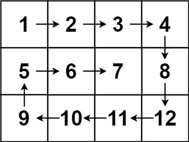
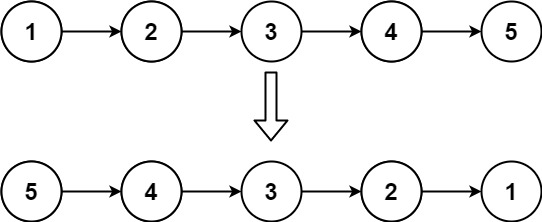
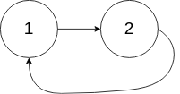
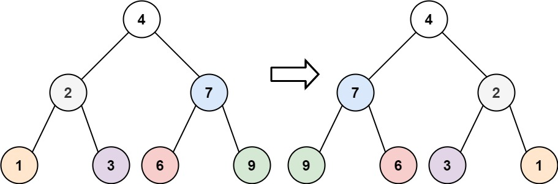
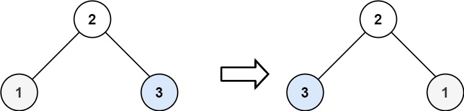
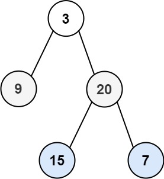

## LeetCode 热题Top100

### 238. 除自身以外数组的乘积
给你一个整数数组 nums，返回 数组 answer ，其中 answer[i] 等于 nums 中除 nums[i] 之外其余各元素的乘积 。
题目数据 保证 数组 nums之中任意元素的全部前缀元素和后缀的乘积都在  32 位 整数范围内。
请 不要使用除法，且在 O(n) 时间复杂度内完成此题。

示例 1:
>输入: nums = [1,2,3,4]
>输出: [24,12,8,6]

示例 2:
>输入: nums = [-1,1,0,-3,3]
>输出: [0,0,9,0,0]

```java
public class Solution {
    public int[] productExceptSelf(int[] nums) {
        int[] res = new int[nums.length];
        res[0] = 1;
        // 先计算i左侧所有数的乘积
        for (int i = 1; i < nums.length; i++) {
            res[i] = res[i - 1] * nums[i - 1];
        }
        // 存储右边元素的乘积
        int tmp = 1;
        // 计算右上角
        for (int i = nums.length - 2; i >= 0; i--) {
            // 计算右边元素的乘积
            tmp *= nums[i + 1];
            // 左右相乘
            res[i] *= tmp;
        }
        return res;
    }
}

```

### 41. 缺失的第一个正数
给你一个未排序的整数数组 nums ，请你找出其中没有出现的最小的正整数。
请你实现时间复杂度为 O(n) 并且只使用常数级别额外空间的解决方案。


示例 1：
输入：nums = [1,2,0]
输出：3

 
示例 2：
输入：nums = [3,4,-1,1]
输出：2

示例 3：
输入：nums = [7,8,9,11,12]
输出：1
```java

public class Solution {
    /**
     * 哈希表解法， 先放入hash表中，然后从1开始找。
     */
    public int firstMissingPositive(int[] nums) {
        Set<Integer> set = new HashSet<>();
        for (int num : nums) {
            set.add(num);
        }
        int i = 1;
        while (true) {
            if (!set.contains(i)) {
                return i;
            }
            i++;
        }
    }
    /**
     * 数组长度为N， 结果一定是[1,N+1]之间
     * 我们把[1,N+1]之外的数设置为N+1
     * 然后把[1, N]下标对应的数据改为负数
     * 那么第一个正数的下标+1就是结果， 因为[1, N]对应的下标都设置成-1负数了，  没有设置的就是不存在的结果。
     */
    public int firstMissingPositiveV2(int[] nums) {

        int n = nums.length;
        for (int i = 0; i < n; i++) {
            if (nums[i] > n || nums[i] < 1) {
                nums[i] = n + 1;
            }
        }
        for (int i = 0; i < n; i++) {
            // 取绝对值，因为有可能被改成了负数
            int num = Math.abs(nums[i]);
            if (num <= n) {
                // 用绝对值，避免两次修改同一个位置数据，如[1,1]
                nums[num - 1] = -Math.abs(nums[num - 1]);
            }
        }
        for (int i = 0; i < n; i++) {
            if (nums[i] > 0) {
                return i+1;
            }
        }
        // 如果没有找到则直接返回n+1
        return n + 1;
    }
}
```

### 73. 矩阵置零
给定一个 m x n 的矩阵，如果一个元素为 0 ，则将其所在行和列的所有元素都设为 0 。请使用 原地 算法。

示例 1：

输入：matrix = [[1,1,1],[1,0,1],[1,1,1]]
输出：[[1,0,1],[0,0,0],[1,0,1]]

示例 2：

输入：matrix = [[0,1,2,0],[3,4,5,2],[1,3,1,5]]
输出：[[0,0,0,0],[0,4,5,0],[0,3,1,0]]
```java
public class SetMatrixZeroes {

    /**
     * 额外的空间标记
     *
     * @param matrix
     */
    public void setZeroes(int[][] matrix) {
        boolean[] row = new boolean[matrix.length];
        boolean[] col = new boolean[matrix[0].length];

        for (int i = 0; i < matrix.length; i++) {
            for (int j = 0; j < matrix[0].length; j++) {
                // 标记对应的row和col
                if (matrix[i][j] == 0) {
                    row[i] = true;
                    col[j] = true;
                }
            }
        }

        for (int i = 0; i < matrix.length; i++) {
            for (int j = 0; j < matrix[0].length; j++) {
                // row或者col被标记，该元素都为0。
                if (row[i] || col[j]) {
                    matrix[i][j] = 0;
                }
            }
        }
    }

    /**
     * 使用第一行和第一列进行标记
     * [[1,1,1],
     * [1,0,1],
     * [1,1,1]]
     * <p>
     * 用matrix[1,0] 和matrix[0,1]标记，
     * 记录第一行和第一列是否有0
     * @param matrix
     */
    public void setZeroesV2(int[][] matrix) {
        boolean rowFlag = false, colFlag = false;
        // 标记col是否有0
        for (int i = 0; i < matrix.length; i++) {
            if (matrix[i][0] == 0) {
                colFlag = true;
            }
        }
        // 标记row是否有0
        for (int i = 0; i < matrix[0].length; i++) {
            if (matrix[0][i] == 0) {
                rowFlag = true;
            }
        }
        // 如果中间元素有0，标记第一行和第一列
        for (int i = 1; i < matrix.length; i++) {
            for (int j = 1; j < matrix[0].length; j++) {
                if (matrix[i][j] == 0) {
                    matrix[i][0] = 0;
                    matrix[0][j] = 0;
                }
            }
        }
        // 根据第一行和第一列的标记，设置当前元素
        for (int i = 1; i < matrix.length; i++) {
            for (int j = 1; j < matrix[0].length; j++) {
                if (matrix[i][0] == 0 || matrix[0][j] == 0) {
                    matrix[i][j] = 0;
                }
            }
        }
        // 如果列标记为true，则设置第一列所有元素为0
        if (colFlag) {
            for (int i = 0; i < matrix.length; i++) {
                matrix[i][0] = 0;
            }
        }
        // 如果行标记为true，则设置第一行所有元素为0
        if (rowFlag) {
            for (int i = 0; i < matrix[0].length; i++) {
                matrix[0][i] = 0;
            }
        }


    }

    /**
     * 使用第一行和第一列进行标记
     * [[1,1,1],
     * [1,0,1],
     * [1,1,1]]
     * <p>
     * 用matrix[1,0] 和matrix[0,1]标记，
     * 只记录第一列是否有0
     * @param matrix
     */
    public void setZeroesV3(int[][] matrix) {
        boolean colFlag = false;
        // 标记col是否有0
        for (int i = 0; i < matrix.length; i++) {
            if (matrix[i][0] == 0) {
                colFlag = true;
            }

            for (int j = 1; j < matrix[0].length; j++) {
                // 如果中间元素有0，标记第一行和第一列
                if (matrix[i][j] == 0) {
                    matrix[i][0] = 0;
                    matrix[0][j] = 0;
                }
            }
        }
        // 第一行要最后更新
        for (int i = matrix.length - 1; i >= 0; i--) {
            for (int j = 1; j < matrix[0].length; j++) {
                if (matrix[i][0] == 0 || matrix[0][j] == 0) {
                    matrix[i][j] = 0;
                }
            }
            // 如果列标记为true，则设置第一列所有元素为0
            if (colFlag) {
                matrix[i][0] = 0;
            }
        }
    }
}
```

### 54. 螺旋矩阵
给你一个 m 行 n 列的矩阵 matrix ，请按照 顺时针螺旋顺序 ，返回矩阵中的所有元素。
示例 1：

输入：matrix = [[1,2,3],[4,5,6],[7,8,9]]
输出：[1,2,3,6,9,8,7,4,5]
示例 2：

输入：matrix = [[1,2,3,4],[5,6,7,8],[9,10,11,12]]
输出：[1,2,3,4,8,12,˚11,10,9,5,6,7]
```java
public class SpiralMatrix {

    public List<Integer> spiralOrder(int[][] matrix) {
        List<Integer> res = new ArrayList<>();

        int l = 0, r = matrix[0].length - 1, t = 0, b = matrix.length - 1;
        while (true) {
            // 向右移动
            for (int i = l; i <= r; i++) res.add(matrix[t][i]);
            if (++t > b) break; // 向下移动一格，判断是否跳出循环
            // 向下移动
            for (int i = t; i <= b; i++) res.add(matrix[i][r]);
            if (--r < l) break; // 向左移动一格，判断是否跳出循环
            // 向左移动
            for (int i = r; i >= l; i--) res.add(matrix[b][i]);
            if (--b < t) break; // 向上移动一格，判断是否跳出循环
            // 向上移动
            for (int i = b; i >= t; i--) res.add(matrix[i][l]);
            if (++l > r) break; // 向右移动一格，判断是否跳出循环
        }
        return res;
    }
}

```

### 48. 旋转图像
给定一个 n × n 的二维矩阵 matrix 表示一个图像。请你将图像顺时针旋转 90 度。
你必须在 原地 旋转图像，这意味着你需要直接修改输入的二维矩阵。请不要 使用另一个矩阵来旋转图像。

示例 1：
>输入：matrix = [[1,2,3],[4,5,6],[7,8,9]]
输出：[[7,4,1],[8,5,2],[9,6,3]]

示例 2：
>输入：matrix = [[5,1,9,11],[2,4,8,10],[13,3,6,7],[15,14,12,16]]
输出：[[15,13,2,5],[14,3,4,1],[12,6,8,9],[16,7,10,11]]
```java
public class RotateImage {

    /**
     * 顺时针旋转， 相当于沿左上-右下对角线对折，然后反转每一行的位置。
     * @param matrix
     */
    public void rotate(int[][] matrix) {
        int n = matrix.length;
        for (int i = 0; i < n; i++) {
            for (int j = 0; j < i; j++) {
                // 沿着对角线对折
                int tmp = matrix[i][j];
                matrix[i][j] = matrix[j][i];
                matrix[j][i] = tmp;
            }
        }

        for (int i = 0; i < n; i++) {
            reverse(matrix[i]);
        }
    }

    /**
     * 反转数组
     * @param nums
     */
    private void reverse(int[] nums) {
        int start = 0, end = nums.length - 1;
        while (start < end) {
            int tmp = nums[start];
            nums[start] = nums[end];
            nums[end] = tmp;
            start++;
            end--;
        }
    }
}
```


### 240. 搜索二维矩阵 II
编写一个高效的算法来搜索 m x n 矩阵 matrix 中的一个目标值 target 。该矩阵具有以下特性：

每行的元素从左到右升序排列。
每列的元素从上到下升序排列。

示例 1：

输入：matrix = [[1,4,7,11,15],[2,5,8,12,19],[3,6,9,16,22],[10,13,14,17,24],[18,21,23,26,30]], target = 5
输出：true

示例 2：

输入：matrix = [[1,4,7,11,15],[2,5,8,12,19],[3,6,9,16,22],[10,13,14,17,24],[18,21,23,26,30]], target = 20
输出：false
```java
public class SearchA2DMatrix2 {
    public boolean searchMatrix(int[][] matrix, int target) {
        int i = 0, j = matrix[0].length - 1;
        // 从右上角开始查找
        while (i < matrix.length && j >= 0) {
            // 找到了直接返回
            if (matrix[i][j] == target) {
                return true;
            }
            // 如果大于target， 则往左找
            if (matrix[i][j] > target) {
                j--;
            } else { // 如果小于target， 则往下找
                i++;
            }
        }
        return false;
    }
}

```

### 160. 相交链表
给你两个单链表的头节点 headA 和 headB ，请你找出并返回两个单链表相交的起始节点。如果两个链表不存在相交节点，返回 null 。
图示两个链表在节点 c1 开始相交：

题目数据 保证 整个链式结构中不存在环。

注意，函数返回结果后，链表必须 保持其原始结构 。

```java
public class IntersectionOfTwoLinkedLists {

    /**
     *  走到列尾后接着遍历第二个队列， 有相交的话就会同时走到相同的节点，如果没有相交的话第二次会同时到达列尾。
     */
    public ListNode getIntersectionNode(ListNode headA, ListNode headB) {
        ListNode pA = headA, pB = headB;
        while (pA != pB) {
            pA = pA == null ? headB : pA.next;
            pB = pB == null ? headA : pB.next;
        }
        return pA;
    }
}
```

### 206. 反转链表
给你单链表的头节点 head ，请你反转链表，并返回反转后的链表。

示例 1：

输入：head = [1,2,3,4,5]
输出：[5,4,3,2,1]

示例 2：


输入：head = [1,2]
输出：[2,1]

示例 3：
输入：head = []
输出：[]
```java
public class ReverseLinkedList {

    /**
     * 递归反转， 后续遍历
     */
    public ListNode reverseList(ListNode head) {
        if (head == null || head.next == null) {
            return head;
        }

        ListNode tail = reverseList(head.next);
        // 反转下一个节点的指针
        head.next.next = head;
        // 重置当前节点的下一个
        head.next = null;

        return tail;
    }

    /**
     * 遍历反转 [1,2,3,4,5]
     */
    public ListNode reverseListV2(ListNode head) {
        ListNode pre = null;
        while (head != null) {
            // 记录下一个节点
            ListNode next = head.next;
            // 反转当前节点
            head.next = pre;
            pre = head;
            head = next;
        }
        return pre;
    }
}
```
### 234. 回文链表
给你一个单链表的头节点 head ，请你判断该链表是否为回文链表。如果是，返回 true ；否则，返回 false 。
示例 1：

输入：head = [1,2,2,1]
输出：true

示例 2：

输入：head = [1,2]
输出：false
```java
public class PalindromeLinkedList {

    ListNode frontPointer;

    /**
     * 递归方法，对比第一个和最后一个节点，
     * 最后一个节点反向出栈， 第一个节点向后移动
     * @param head
     * @return
     */
    public boolean isPalindrome(ListNode head) {
        frontPointer = head;
        return isSame(head);
    }
    private boolean isSame(ListNode head) {
        if (head != null) {
            // 递归走到最后一个节点，下一个节点不想等，则直接返回false
            if (!isSame(head.next)) {
                return false;
            }
            // 判断前后两个节点是否相等
            if (frontPointer.val != head.val) {
                return false;
            }
            frontPointer = frontPointer.next;
        }
        return true;
    }


    /**
     * 双指针
     * @param head
     * @return
     */
    public boolean isPalindromeV2(ListNode head) {
        ListNode fast = head, slow = head;
        while (fast != null && fast.next != null) {
            fast = fast.next.next;
            slow = slow.next;
        }

        ListNode left = head;
        ListNode right = reverse(slow);
        while (right != null) {
            if (left.val != right.val) {
                return false;
            }
            left = left.next;
            right = right.next;
        }
        return true;

    }
    private ListNode reverse(ListNode head) {
        ListNode pre = null;
        while (head != null) {
            ListNode next = head.next;
            head.next = pre;
            pre = head;
            head = next;
        }
        return pre;
    }
}
```

### 141. 环形链表
给你一个链表的头节点 head ，判断链表中是否有环。

如果链表中有某个节点，可以通过连续跟踪 next 指针再次到达，则链表中存在环。 为了表示给定链表中的环，评测系统内部使用整数 pos 来表示链表尾连接到链表中的位置（索引从 0 开始）。注意：pos 不作为参数进行传递 。仅仅是为了标识链表的实际情况。

如果链表中存在环 ，则返回 true 。 否则，返回 false 。

示例 1：


输入：head = [3,2,0,-4], pos = 1
输出：true
解释：链表中有一个环，其尾部连接到第二个节点。

示例 2：


输入：head = [1,2], pos = 0
输出：true
解释：链表中有一个环，其尾部连接到第一个节点。

示例 3：


输入：head = [1], pos = -1
输出：false
解释：链表中没有环。
 
### 142. 环形链表 II
给定一个链表的头节点  head ，返回链表开始入环的第一个节点。 如果链表无环，则返回 null。

如果链表中有某个节点，可以通过连续跟踪 next 指针再次到达，则链表中存在环。 为了表示给定链表中的环，评测系统内部使用整数 pos 来表示链表尾连接到链表中的位置（索引从 0 开始）。如果 pos 是 -1，则在该链表中没有环。注意：pos 不作为参数进行传递，仅仅是为了标识链表的实际情况。

不允许修改 链表。

示例 1：

输入：head = [3,2,0,-4], pos = 1
输出：返回索引为 1 的链表节点
解释：链表中有一个环，其尾部连接到第二个节点。

示例 2：

输入：head = [1,2], pos = 0
输出：返回索引为 0 的链表节点
解释：链表中有一个环，其尾部连接到第一个节点。

示例 3：

输入：head = [1], pos = -1
输出：返回 null
解释：链表中没有环。
```java
public class LinkedListCycle2 {

    /**
     * 1. 先找到相遇点。
     * 2. 找到交点后，将其中一个指针从头开始，并行走，再次相遇的地方就是交点 
     */
    public ListNode detectCycle(ListNode head) {
        ListNode fast = head, slow = head;
        while (fast != null && fast.next != null) {
            fast = fast.next.next;
            slow = slow.next;

            if (fast == slow) {
                break;
            }
        }
        if (fast == null || fast.next == null) {
            return null;
        }
        fast = head;
        while (fast != slow) {
            fast = fast.next;
            slow = slow.next;
        }
        return fast;
    }
}
```
### 21. 合并两个有序链表
将两个升序链表合并为一个新的 升序 链表并返回。新链表是通过拼接给定的两个链表的所有节点组成的。

示例 1：

输入：l1 = [1,2,4], l2 = [1,3,4]
输出：[1,1,2,3,4,4]

示例 2：
输入：l1 = [], l2 = []
输出：[]

示例 3：
输入：l1 = [], l2 = [0]
输出：[0]
```java
public class MergeTwoSortedLists {

    public ListNode mergeTwoLists(ListNode list1, ListNode list2) {
        // 定义一个临时头节点
        ListNode pre = new ListNode(-1);
        // 当前指针
        ListNode curr = pre;
        while (list1 != null && list2 != null) {
            // 哪个小就挂在curr的next
            if (list1.val < list2.val) {
                curr.next = list1;
                list1 = list1.next;
            }else {
                curr.next = list2;
                list2 = list2.next;
            }
            // 移动curr
            curr = curr.next;
        }
        // 另一个非空的节点直接挂在curr后面。
        curr.next = list1 == null ? list2 : list1;
        return pre.next;
    }
}
```
### 2. 两数相加
给你两个 非空 的链表，表示两个非负的整数。它们每位数字都是按照 逆序 的方式存储的，并且每个节点只能存储 一位 数字。

请你将两个数相加，并以相同形式返回一个表示和的链表。

你可以假设除了数字 0 之外，这两个数都不会以 0 开头。

示例 1：

输入：l1 = [2,4,3], l2 = [5,6,4]
输出：[7,0,8]
解释：342 + 465 = 807.

示例 2：
输入：l1 = [0], l2 = [0]
输出：[0]

示例 3：
输入：l1 = [9,9,9,9,9,9,9], l2 = [9,9,9,9]
输出：[8,9,9,9,0,0,0,1]
```java
public class AddTwoNumbers {

    public ListNode addTwoNumbers(ListNode l1, ListNode l2) {
        ListNode dummy = new ListNode(-1);
        ListNode curr = dummy;
        int carry = 0;
        while (l1 != null || l2 != null) {
            int a = l1 == null ? 0 : l1.val;
            int b = l2 == null ? 0 : l2.val;
            int sum = a + b + carry;
            // 计算进位
            carry = sum / 10;
            // 创建节点
            curr.next = new ListNode(sum % 10);
            curr = curr.next;
            // 向后移动
            l1 = l1 == null ? null : l1.next;
            l2 = l2 == null ? null : l2.next;
        }
        if (carry > 0) {
            curr.next = new ListNode(carry);
        }
        return dummy.next;
    }
}

```

### 19. 删除链表的倒数第 N 个结点
给你一个链表，删除链表的倒数第 n 个结点，并且返回链表的头结点。

示例 1：

输入：head = [1,2,3,4,5], n = 2
输出：[1,2,3,5]

示例 2：
输入：head = [1], n = 1
输出：[]

示例 3：

输入：head = [1,2], n = 1
输出：[1]
```java
public class RemoveNthNodeFromEndOfLinkedList {

    public ListNode removeNthFromEnd(ListNode head, int n) {
        ListNode fast = head, slow = head;
        // 快指针先走n步
        for (int i = 0; i < n; i++) {
            fast = fast.next;
        }
        // 定义一个dummy节点，规避head被删除的情况
        ListNode dummy = new ListNode(-1);
        dummy.next = head;
        ListNode pre = dummy;
        // 快指针到null是，slow即为倒数第n个节点。
        while (fast != null) {
            fast = fast.next;
            slow = slow.next;
            pre = pre.next;
        }
        // 删除节点
        pre.next = slow.next;

        return dummy.next;
    }
}
```

### 24. 两两交换链表中的节点
给你一个链表，两两交换其中相邻的节点，并返回交换后链表的头节点。你必须在不修改节点内部的值的情况下完成本题（即，只能进行节点交换）。

示例 1：

输入：head = [1,2,3,4]
输出：[2,1,4,3]

示例 2：
输入：head = []
输出：[]

示例 3：
输入：head = [1]
输出：[1]
```java
public class SwapNodesInPairs {

    /**
     * 遍历解法： [1,2,3,4]
     *  同时保存三个元素： curr(0),  curr.next(1) , curr.next.next(2)
     *  0 -> 1 -> 2 -> 3
     *  0 -> 2 -> 3 (2)
     *  1 -> 3 (0 -> 2)
     *  (0 -> 2) -> (1 -> 3)
     *  0 == 1
     */
    public ListNode swapPairs(ListNode head) {

        ListNode dummy = new ListNode(-1);
        dummy.next = head;
        ListNode curr = dummy;
        while (curr.next != null && curr.next.next != null) {
            // 记录第一个元素
            ListNode next = curr.next;
            // 交换元素
            curr.next = next.next;
            next.next = curr.next.next;
            curr.next.next = next;
            // 移动当前指针
            curr = next;
        }
        return dummy.next;
    }

    /**
     * 递归解法
     */
    public ListNode swapPairsV2(ListNode head) {
        if (head == null || head.next == null) {
            return head;
        }

        ListNode first = head;
        ListNode second = head.next;
        ListNode third = head.next.next;

        // 交换first 和 second
        second.next = first;
        // first.next = 下一个头元素
        first.next = swapPairsV2(third);
        // 返回交换后的头元素
        return second;
    }
}
```

### 25. K 个一组翻转链表
给你链表的头节点 head ，每 k 个节点一组进行翻转，请你返回修改后的链表。

k 是一个正整数，它的值小于或等于链表的长度。如果节点总数不是 k 的整数倍，那么请将最后剩余的节点保持原有顺序。

你不能只是单纯的改变节点内部的值，而是需要实际进行节点交换。

示例 1：

输入：head = [1,2,3,4,5], k = 2
输出：[2,1,4,3,5]

示例 2：

输入：head = [1,2,3,4,5], k = 3
输出：[3,2,1,4,5]
```java
public class ReverseNodesInKGroup {

    public ListNode reverseKGroup(ListNode head, int k) {
        // 找到第k+1个节点
        ListNode end = head;
        for (int i = 0; i < k; i++) {
            if (end == null) {
                return head;
            }
            end = end.next;
        }
        // 反转k个节点[head, end)
        ListNode pre = null;
        ListNode curr = head;
        while (curr != end) {
            ListNode next = curr.next;
            curr.next = pre;
            pre = curr;
            curr = next;
        }
        // head变为最后一个节点， head连接下一组节点的头
        head.next = reverseKGroup(curr, k);
        // 返回头节点
        return pre;
    }
}
```

### 138. 随机链表的复制
给你一个长度为 n 的链表，每个节点包含一个额外增加的随机指针 random ，该指针可以指向链表中的任何节点或空节点。

构造这个链表的 深拷贝。 深拷贝应该正好由 n 个 全新 节点组成，其中每个新节点的值都设为其对应的原节点的值。新节点的 next 指针和 random 指针也都应指向复制链表中的新节点，并使原链表和复制链表中的这些指针能够表示相同的链表状态。复制链表中的指针都不应指向原链表中的节点 。

例如，如果原链表中有 X 和 Y 两个节点，其中 X.random --> Y 。那么在复制链表中对应的两个节点 x 和 y ，同样有 x.random --> y 。

返回复制链表的头节点。

用一个由 n 个节点组成的链表来表示输入/输出中的链表。每个节点用一个 [val, random_index] 表示：

val：一个表示 Node.val 的整数。
random_index：随机指针指向的节点索引（范围从 0 到 n-1）；如果不指向任何节点，则为  null 。
你的代码 只 接受原链表的头节点 head 作为传入参数。

示例 1：

输入：head = [[7,null],[13,0],[11,4],[10,2],[1,0]]
输出：[[7,null],[13,0],[11,4],[10,2],[1,0]]

示例 2：

输入：head = [[1,1],[2,1]]
输出：[[1,1],[2,1]]

示例 3：

输入：head = [[3,null],[3,0],[3,null]]
输出：[[3,null],[3,0],[3,null]]
```java
public class CopyListWithRandomPointer {

    /**
     * 遍历复制， 遍历每个节点的时候都复制next和random
     */
    public Node copyRandomList(Node head) {
        if (head == null) {
            return null;
        }
        Map<Node, Node> map = new HashMap<>();
        Node p = head;
        map.put(p, new Node(p.val));
        while (p != null) {
            // copy p.next
            if (p.next != null) {
                // 第一次出现的节点要保存到map中
                if (!map.containsKey(p.next)) {
                    map.put(p.next, new Node(p.next.val));
                }
                map.get(p).next = map.get(p.next);
            }
            // copy p.random
            if (p.random != null) {
                // 第一次出现的节点要保存到map中
                if (!map.containsKey(p.random)) {
                    map.put(p.random, new Node(p.random.val));
                }
                map.get(p).random = map.get(p.random);
            }
            p = p.next;
        }
        return map.get(head);
    }
}
```

### 146. LRU 缓存
请你设计并实现一个满足  LRU (最近最少使用) 缓存 约束的数据结构。
实现 LRUCache 类：
LRUCache(int capacity) 以 正整数 作为容量 capacity 初始化 LRU 缓存
int get(int key) 如果关键字 key 存在于缓存中，则返回关键字的值，否则返回 -1 。
void put(int key, int value) 如果关键字 key 已经存在，则变更其数据值 value ；如果不存在，则向缓存中插入该组 key-value 。如果插入操作导致关键字数量超过 capacity ，则应该 逐出 最久未使用的关键字。
函数 get 和 put 必须以 O(1) 的平均时间复杂度运行。

示例：

输入
["LRUCache", "put", "put", "get", "put", "get", "put", "get", "get", "get"]
[[2], [1, 1], [2, 2], [1], [3, 3], [2], [4, 4], [1], [3], [4]]
输出
[null, null, null, 1, null, -1, null, -1, 3, 4]

解释
LRUCache lRUCache = new LRUCache(2);
lRUCache.put(1, 1); // 缓存是 {1=1}
lRUCache.put(2, 2); // 缓存是 {1=1, 2=2}
lRUCache.get(1);    // 返回 1
lRUCache.put(3, 3); // 该操作会使得关键字 2 作废，缓存是 {1=1, 3=3}
lRUCache.get(2);    // 返回 -1 (未找到)
lRUCache.put(4, 4); // 该操作会使得关键字 1 作废，缓存是 {4=4, 3=3}
lRUCache.get(1);    // 返回 -1 (未找到)
lRUCache.get(3);    // 返回 3
lRUCache.get(4);    // 返回 4

```java
public class LRUCache {

    private final int capacity;

    private LinkedHashMap<Integer, Integer> map;

    public LRUCache(int capacity) {
        this.capacity = capacity;
        map = new LinkedHashMap<>(capacity);
    }

    public int get(int key) {
        if (map.containsKey(key)) {
            makeRecently(key);
            return map.get(key);
        }
        return -1;
    }

    public void put(int key, int value) {
        if (map.containsKey(key)) {
            map.put(key, value);
            makeRecently(key);
            return;
        }
        if (map.size() == capacity) {
            Integer first = map.keySet().iterator().next();
            map.remove(first);
        }
        map.put(key, value);
    }

    /**
     * 核心方法，实现将元素添加到队尾
     * @param key
     */
    private void makeRecently(int key) {
        Integer value = map.remove(key);
        map.put(key, value);
    }
}
```

## 二叉树
### 94. 二叉树的中序遍历
给定一个二叉树的根节点 root ，返回 它的 中序 遍历 。

示例 1：

输入：root = [1,null,2,3]
输出：[1,3,2]

示例 2：
输入：root = []
输出：[]

示例 3：
输入：root = [1]
输出：[1]
```java
public class BinaryTreeInorderTraversal {
    /**
     * 递归
     */
    public List<Integer> inorderTraversal(TreeNode root) {
        List<Integer> res = new ArrayList<>();
        inorderTraversal(root, res);
        return res;
    }
    public void inorderTraversal(TreeNode root, List<Integer> res) {
        if (root == null) {
            return;
        }
        inorderTraversal(root.left, res);
        res.add(root.val);
        inorderTraversal(root.right, res);
    }

    /**
     * 动态规划
     */
    public List<Integer> inorderTraversalV2(TreeNode root) {
        List<Integer> res = new ArrayList<>();
        if (root == null) {
            return res;
        }
        // 添加左节点
        res.addAll(inorderTraversalV2(root.left));
        // 添加根节点
        res.add(root.val);
        // 添加右节点
        res.addAll(inorderTraversalV2(root.right));
        return res;
    }
}
```

### 104. 二叉树的最大深度
给定一个二叉树 root ，返回其最大深度。

二叉树的 最大深度 是指从根节点到最远叶子节点的最长路径上的节点数。

示例 1：

输入：root = [3,9,20,null,null,15,7]
输出：3

示例 2：
输入：root = [1,null,2]
输出：2
```java
public class MaximumDepthOfBinaryTree {

    /**
     * 动态规划
     * @param root
     * @return
     */
    public int maxDepth(TreeNode root) {
        if (root == null) {
            return 0;
        }
        // 左节点的最大高度
        int leftMax = maxDepth(root.left);
        // 右节点的最大高度
        int rightMax = maxDepth(root.right);
        // 当前节点的最大深度 = 左右节点最大深度 + 1
        return 1 + Math.max(leftMax, rightMax);
    }

    /**
     * 回溯算法，遍历二叉树
     */
    int depth = 0;
    int res = 0;
    public int maxDepthV2(TreeNode root) {
        traverse(root);
        return res;
    }

    private void traverse(TreeNode root) {
        if (root == null) {
            return;
        }
        depth++;
        res = Math.max(res, depth);
        traverse(root.left);
        traverse(root.right);
        depth--;
    }
}
```

### 226. 翻转二叉树
给你一棵二叉树的根节点 root ，翻转这棵二叉树，并返回其根节点。

示例 1：

输入：root = [4,2,7,1,3,6,9]
输出：[4,7,2,9,6,3,1]

示例 2：

输入：root = [2,1,3]
输出：[2,3,1]

示例 3：
输入：root = []
输出：[]
```java
public class InvertBinaryTree {

    /**
     * 方法一：分解思路，动态规划
     */
    public TreeNode invertTree(TreeNode root) {
        if (root == null) {
            return null;
        }
        // 先存储临时变量，方便下面使用
        TreeNode left = root.left;
        TreeNode right = root.right;
        // 翻转right节点， 赋值给root.left
        root.left = invertTree(right);
        // 翻转left节点，赋值给root.right
        root.right = invertTree(left);

        return root;
    }

    /**
     * 方法二： 二叉树遍历，遍历前先进行左右节点交换
     */
    public TreeNode invertTreeV2(TreeNode root) {
        reverse(root);
        return root;
    }

    // 前序遍历， 遍历前先交换左右节点
    private void reverse(TreeNode node) {
        if (node == null) {
            return;
        }
        // 前序遍历
        TreeNode tmp = node.left;
        node.left = node.right;
        node.right = tmp;
        // 递归遍历左右节点
        reverse(node.left);
        reverse(node.right);
    }
}
```

### 101. 对称二叉树
给你一个二叉树的根节点 root ， 检查它是否轴对称。

示例 1：


输入：root = [1,2,2,3,4,4,3]
输出：true

示例 2：


输入：root = [1,2,2,null,3,null,3]
输出：false

```java
public class SymmetricTree {

    /**
     * 方法一： 分解方法，分别比较每个节点的左右节点是否相等。
     */
    public boolean isSymmetric(TreeNode root) {
        if (root == null) {
            return true;
        }
        return isSame(root.left, root.right);

    }

    /**
     * 比较两个节点是否是否相等
     */
    private boolean isSame(TreeNode left, TreeNode right) {
        if (left == null && right == null) { // 左右节点都为null，则是对称的
            return true;
        } else if (left == null || right == null) { // 一个为null，另一个不为null，则不为对称。
            return false;
        }
        // 左右节点的值相等 && 左节点的左子节点 == 右节点的右子节点 && 左节点的右子节点 == 右节点的左子节点
        return left.val == right.val && isSame(left.left, right.right) && isSame(left.right, right.left);
    }


    /**
     * 方法二： 广度优先方法， 每次取两个节点进行对比
     */
    public boolean isSymmetricV2(TreeNode root) {
        if (root == null) {
            return true;
        }
        return check(root, root);

    }

    /**
     * 广度优先算法
     */
    private boolean check(TreeNode p, TreeNode q) {
        LinkedList<TreeNode> queue = new LinkedList<>();
        queue.offer(p);
        queue.offer(q);
        while (!queue.isEmpty()) {
            p = queue.pop();
            q = queue.pop();

            if (p == null && q == null) {
                continue;
            }
            if (p == null || q == null) {
                return false;
            }
            if (p.val != q.val) {
                return false;
            }
            // 插入一对待比较的节点
            queue.offer(p.left);
            queue.offer(q.right);
            // 插入另一对待比较的节点
            queue.offer(p.right);
            queue.offer(q.left);

        }
        return true;
    }
}
```

### 543. 二叉树的直径
给你一棵二叉树的根节点，返回该树的 直径 。

二叉树的 直径 是指树中任意两个节点之间最长路径的 长度 。这条路径可能经过也可能不经过根节点 root 。

两节点之间路径的 长度 由它们之间边数表示。

示例 1：


输入：root = [1,2,3,4,5]
输出：3
解释：3 ，取路径 [4,2,1,3] 或 [5,2,1,3] 的长度。

示例 2：

输入：root = [1,2]
输出：1
```java
public class DiameterBinaryTree {

    /**
     * 方法一： 转换成求最大深度， 左子节点的最大深度 + 右子节点的最大深度 = 当前节点的最大直径
     */

    int maxDiameter = 0;

    public int diameterOfBinaryTree(TreeNode root) {
        maxDepth(root);
        return maxDiameter;
    }

    private int maxDepth(TreeNode root) {
        if (root == null) {
            return 0;
        }
        int maxLeft = maxDepth(root.left);
        int maxRight = maxDepth(root.right);
        // 后序遍历， 从最低端开始计算
        maxDiameter = Math.max(maxDiameter, maxLeft + maxRight);
        return 1 + Math.max(maxLeft, maxRight);
    }
}
```

### 102. 二叉树的层序遍历
给你二叉树的根节点 root ，返回其节点值的 层序遍历 。 （即逐层地，从左到右访问所有节点）。

示例 1：


输入：root = [3,9,20,null,null,15,7]
输出：[[3],[9,20],[15,7]]

示例 2：
输入：root = [1]
输出：[[1]]

示例 3：
输入：root = []
输出：[]
```java
public class BinaryTreeLevelOrderTraversal {

    /**
     * 方法一： 广度优先算法（BFS)。
     */
    public List<List<Integer>> levelOrder(TreeNode root) {
        List<List<Integer>> res = new ArrayList<>();
        if (root == null) {
            return res;
        }
        LinkedList<TreeNode> queue = new LinkedList<>();
        queue.offer(root);
        while (!queue.isEmpty()) {
            List<Integer> list = new ArrayList<>();
            int size = queue.size(); // 先获取当前层的节点数
            for (int i = 0; i < size; i++) {
                TreeNode node = queue.poll();
                list.add(node.val);
                // 插入下层的节点， 因为上面已经先计算了当前层的节点数，所以list只会add当前节点的值。
                if (node.left != null) {
                    queue.offer(node.left);
                }
                if (node.right != null) {
                    queue.offer(node.right);
                }
            }

            res.add(list);
        }
        return res;
    }
}
```

### 108. 将有序数组转换为二叉搜索树
给你一个整数数组 nums ，其中元素已经按 升序 排列，请你将其转换为一棵 高度平衡 二叉搜索树。

高度平衡 二叉树是一棵满足「每个节点的左右两个子树的高度差的绝对值不超过 1 」的二叉树。

示例 1：


输入：nums = [-10,-3,0,5,9]
输出：[0,-3,9,-10,null,5]
解释：[0,-10,5,null,-3,null,9] 也将被视为正确答案：

示例 2：


输入：nums = [1,3]
输出：[3,1]
解释：[1,null,3] 和 [3,1] 都是高度平衡二叉搜索树。
```java
public class ConvertSortedArrayToBinarySearchTree {
    /**
     * 二叉搜索树的中序遍历是升序序列， 高度平衡的二叉树，选择数组的中间位置作为根节点。
     */
    public TreeNode sortedArrayToBST(int[] nums) {
        return inorderTraversal(nums, 0, nums.length - 1);
    }

    /**
     * 将闭区间的数组转换成二叉树 [left,  right]
     */
    private TreeNode inorderTraversal(int[] nums, int left, int right) {

        if (left > right) {
            return null;
        }
        // 获取根节点
        int mid = (left + right) / 2;
        TreeNode root = new TreeNode(nums[mid]);
        // 处理[left, mid - 1]
        root.left = inorderTraversal(nums, left, mid - 1);
        // 处理 [mid + 1, right]
        root.right = inorderTraversal(nums, mid + 1, right);
        return root;
    }
}

```
### 98. 验证二叉搜索树
给你一个二叉树的根节点 root ，判断其是否是一个有效的二叉搜索树。

有效 二叉搜索树定义如下：

节点的左子树只包含 小于 当前节点的数。
节点的右子树只包含 大于 当前节点的数。
所有左子树和右子树自身必须也是二叉搜索树。

示例 1：


输入：root = [2,1,3]
输出：true

示例 2：


输入：root = [5,1,4,null,null,3,6]
输出：false
解释：根节点的值是 5 ，但是右子节点的值是 4 。
```java
public class ValidateBinarySearchTree {

    // 使用long类型，处理Integer.MIN_VALUE边界值
    long p = Long.MIN_VALUE;
    /**
     * 中序遍历
     */
    public boolean isValidBST(TreeNode root) {
        if (root == null) {
            return true;
        }
        if (!isValidBST(root.left)) {
            return false;
        }
        if (p > root.val) {
            return false;
        }
        p = root.val;
        if (!isValidBST(root.right)) {
            return false;
        }
        return true;

    }

    public boolean isValidBSTV2(TreeNode root) {
        return isValidBST(root, Long.MIN_VALUE, Long.MAX_VALUE);
    }

    public boolean isValidBST(TreeNode root, long min, long max) {
        if (root == null) {
            return true;
        }
        if (root.val <= min || root.val >= max) {
            return false;
        }
        // 左子节点不大于当前节点， 右子节点不小于当前节点
        return isValidBST(root.left, min, root.val) && isValidBST(root.right, root.val, max);
    }
}
```

### 230. 二叉搜索树中第K小的元素
给定一个二叉搜索树的根节点 root ，和一个整数 k ，请你设计一个算法查找其中第 k 个最小元素（从 1 开始计数）。

示例 1：


输入：root = [3,1,4,null,2], k = 1
输出：1

示例 2：


输入：root = [5,3,6,2,4,null,null,1], k = 3
输出：3
```java
public class KthSmallestElementInABST {
    int n = 1;
    Integer res = null;

    public int kthSmallest(TreeNode root, int k) {
        inorderTraversal(root, k);
        return res;

    }

    /**
     * 中序遍历， 每遍历一次，n+1。 当遍历到k时停止遍历。
     * @param root
     * @param k
     */
    private void inorderTraversal(TreeNode root, int k) {
        if (root == null) {
            return;
        }
        inorderTraversal(root.left, k);
        if (n == k) {
            res = root.val;
            return;
        }
        n++;
        inorderTraversal(root.right, k);
    }
}
```
